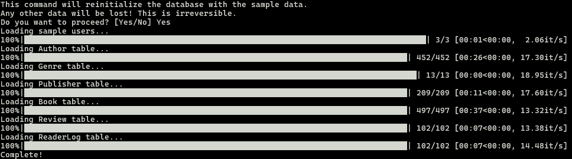

# ETL Process

To have some sample data to populate the database, we have extracted some data from
a dataset on Kaggle that contains Goodreads reviews and book descriptions.

https://www.kaggle.com/datasets/mohamedbakhet/amazon-books-reviews

(The original CSV files, books_data.csv and books_rating" are omitted from the repository due to their size, but can be readily downloaded from Kaggle. The ETL notebooks, fiction.ipynb and reviews.ipynb, are included for process documentation purposes. The two notebooks should be run in order with fiction.ipynb run first, reviews.ipynb second.)

The original is 3.04 GB, containg 212,404 books and 3 million reviews. We have 
extracted from it 500 fictional books and 102 reviews by 3 apparent pseudonymous 
reviewers.

After extracting fictional books (10,354 books), we randomly sampled 500 books. We then
invoked GPT-4o-mini (via the OpenAI API) to categorize the books into genres. There are 13 genres:

- Contemporary Fiction 
- Literary Fiction
- Mystery/Thriller 
- Historical Fiction 
- Science Fiction 
- Fantasy 
- Romance 
- Young Adult Fiction 
- Dystopian Fiction 
- Horror 
- Magical Realism 
- Adventure Fiction 
- Miscellaneous Fiction 

We then extracted reviews for the selected books (in reviews.ipynb), and from them we selected unique reviews for two pseudonymous reviews. These will give us two "dummy users" to populate the reviews table as well as populating the book catalog to have testing data. 

The following CSV files are created in the data/ subdirecotry by running the two notebooks:

- Book.csv
- Genre.csv
- Author.csv
- Publisher.csv
- Review.csv
- ReaderLog.csv

These files exactly mirror the Django models.

## Loading the sample data in the DB

1) Navigate to the _server/ subdirectory
2) Perform migrations if needed, creating the DB
3) Run ```python manage.py load_db``` to load sample data to the DB
4) Run ```python manage.py index_books``` build index of database for similarity searches


   

